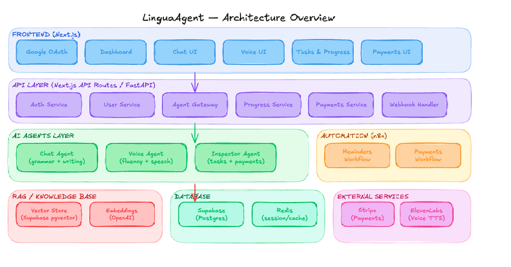

# LinguaAgent — Technical Planning

## 1. Overview

Online English learning platform powered entirely by AI agents — no human instructors. Agents cover written practice, spoken practice, and student progress supervision.

### Architecture Overview



---

## 2. Tech Stack

| Layer | Technology | Why |
|-------|-----------|-----|
| Frontend | Next.js + Tailwind | SSR, routing, fast UI |
| Auth | NextAuth + Google OAuth | Frictionless social login |
| API | Next.js API Routes or FastAPI | Gateway to agents and DB |
| AI Agents | Claude API (Anthropic) | Best-in-class at conversation and correction |
| Voice | ElevenLabs (TTS) + Whisper (STT) | Voice synthesis and transcription |
| Automation | n8n (self-hosted) | Complex workflows, sensitive data stays in-house |
| Simple automation | Zapier | Quick integrations outside the core (e.g. Stripe → Gmail) |
| Database | Supabase (Postgres) | Built-in auth, realtime, pgvector |
| Cache / Sessions | Redis | Short-term conversation memory |
| Vector Store | Supabase pgvector | RAG over course content |
| Embeddings | OpenAI text-embedding-3-small | Best cost/quality ratio |
| Payments | Stripe | Industry standard, reliable webhooks |
| Infrastructure | AWS (ECS + RDS) or Supabase Cloud | Scalable, n8n self-hosted on EC2 |

---

## 3. The Three Agents

### 3.1 Chat Agent — Written Practice
**Purpose:** Text-based conversational class. Corrects grammar and writing fluency.

**How it works:**
- Student writes messages in English
- Agent responds naturally AND adds a grammar note at the end of each turn
- Short-term memory via Redis (last N messages)
- Access to student level via RAG (topics covered, frequent errors)

**Prompt design:**
```
You are an English teacher. Have a natural conversation with the student.
After each student message, respond naturally first, then add a brief
grammar note if there are errors. Be encouraging.
Student level: {level}. Recent errors: {rag_context}.
```

**Agent tools:**
- `get_student_profile` — level, completed lessons, frequent errors
- `save_session_notes` — saves turn errors for the Inspector Agent
- `complete_task` — marks a task as done if applicable

---

### 3.2 Voice Agent — Spoken Practice
**Purpose:** Voice conversation. Prioritizes fluency over perfect grammar.

**How it works:**
1. User speaks → Whisper transcribes to text
2. Text goes to LLM (Claude API) with a fluency-focused prompt
3. LLM response → ElevenLabs converts to audio
4. Audio plays back to the student

**Key difference vs Chat Agent:**
- Prompt is more permissive on grammar — does not interrupt the flow
- Grammar feedback accumulates and is delivered at session end, not in real time
- Latency is critical — response must feel natural (< 2s target)

**Prompt design:**
```
You are a friendly English conversation partner. Focus on keeping
the conversation flowing. Note grammar issues internally but do NOT
correct mid-conversation. Deliver a summary at session end.
Student level: {level}.
```

---

### 3.3 Inspector Agent — System Supervisor
**Purpose:** Does not interact with the student directly. Backend agent that monitors progress, triggers reminders, and manages payments.

**Responsibilities:**
- Detect incomplete tasks → trigger reminder via n8n
- Detect overdue payment → escalate to collections workflow in n8n
- Calculate student level based on completed sessions and error patterns
- Generate weekly progress report

**Note:** Most of its logic is deterministic (rules + DB queries). The LLM is only used to generate the progress report in natural language.

---

## 4. RAG — Knowledge Base

**What the vector store contains:**
- Course content: lessons, grammar explanations, vocabulary by level
- Student profile: frequent errors, covered topics, notes from past sessions
- Policies: pricing, plans, terms of service

**RAG flow:**
```
Agent query → Query embedding →
Semantic search in pgvector →
Top-K relevant chunks →
Injected into agent system prompt
```

**Chunking strategy:**
- Course content: ~500 token chunks per topic
- Student profile: updated after each session by the Inspector Agent

---

## 5. Automation

### n8n (self-hosted on EC2)
Workflows handled by n8n:

| Workflow | Trigger | Actions |
|----------|---------|---------|
| Class reminder | Daily cron | Query DB → if class pending → email/WhatsApp |
| Overdue task | Webhook from Inspector Agent | Notification → if 3 days no action → escalate to email |
| Failed payment | Stripe webhook | Email to user → if 7 days → suspend access |
| Weekly report | Sunday cron | Inspector Agent generates report → email to student |
| HITL escalation | Inspector Agent detects anomaly | Notify admin → wait for approval → take action |

### Zapier (cloud)
Used only for simple integrations outside the core:
- Stripe event → update row in Google Sheets (founder's financial report)
- New user → add to email marketing list (Mailchimp / Resend)

### Why n8n and not everything in Zapier?
- Student data is sensitive — it must not pass through third-party servers
- Workflows require complex conditional logic and custom code
- n8n self-hosted on AWS keeps everything within the same infrastructure

---

## 6. Data Model (Supabase)

```
users
  id, email, name, google_id, plan, created_at

student_profiles
  id, user_id, level, total_sessions, streak_days

sessions
  id, user_id, agent_type (chat|voice), started_at, ended_at, summary

tasks
  id, user_id, title, due_date, completed_at, assigned_by_agent

grammar_notes
  id, session_id, error_type, original_text, correction, timestamp

payments
  id, user_id, stripe_subscription_id, status, next_billing_date
```

---

## 7. Auth Flow

1. User clicks "Sign in with Google"
2. NextAuth handles the OAuth flow with Google
3. On completion: creates or updates record in `users` in Supabase
4. JWT session is generated — used in all API calls
5. Agent Gateway validates JWT before dispatching to the corresponding agent

---

## 8. Human-in-the-Loop (HITL)

Moments where a human intervenes:

| Situation | Who notifies | Expected action |
|-----------|-------------|----------------|
| Student reports agent issue | Inspector Agent → n8n → Slack | Admin reviews and responds |
| Payment dispute | Stripe webhook → n8n | Admin approves or rejects refund |
| Student inactive for 2 weeks | Inspector Agent → n8n | Admin decides whether to reach out manually |

---

## 9. Key Architecture Decisions

**Why Supabase and not Firebase?**
Native pgvector — the same Postgres that stores data also serves as the vector store. Fewer services, less complexity.

**Why n8n self-hosted and not Make?**
Sensitive student data must not leave the infrastructure. n8n on EC2 guarantees this.

**Why Claude and not GPT-4?**
Better at following complex format instructions (grammar correction + conversation simultaneously) and more predictable on long prompts.

**Why ElevenLabs and not just Web Speech API?**
Significantly better voice quality. For a language learning product, audio naturalness is critical.

---

## 10. Development Phases

**Phase 1 — MVP (4–6 weeks)**
Auth + Dashboard + basic Chat Agent + Supabase schema

**Phase 2 — Voice + RAG (3–4 weeks)**
Voice Agent + RAG pipeline + course knowledge base

**Phase 3 — Automation (2–3 weeks)**
n8n self-hosted + reminder and payment workflows + Inspector Agent

**Phase 4 — Polish + Evaluation (2 weeks)**
Evaluation framework + agent metrics + prompt optimization
